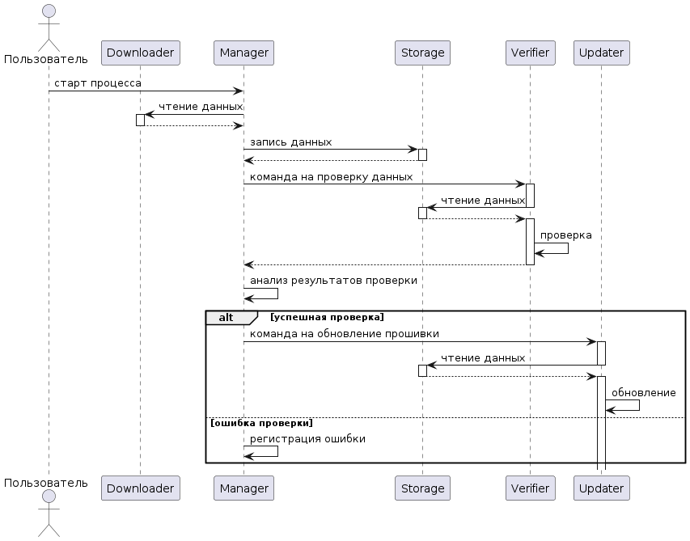

# Упражнение

__Описание__:
Инцидент типа [MitD](https://encyclopedia.kaspersky.com/glossary/man-in-the-disk-mitd).

Существует угроза безопасности, выраженная в подмене файла-обновления программы на _Storage_ в период между его проверкой со стороны _Verifier_ и его уставнокой _Updater_-ом.

## Идея

__Идеальная реализация__:
Введение цифровой подписи _Verifier_-а для файла-обновления и проверка цифровой подписи _Updater_-ом при установке обновления.

На вебинаре, как понял, решили, что это тестовый пример для демонстрации базового понимания функционирования процесса.

__Разумно-достаточная реализация__:
В предположении того, что _Manager_ и _Verifier_ доверенные, как собстенно и _Updater_, а каналы их взаимодействия защищены от подмены передаваемых данных, то в схеме



представляется достаточным через канал с _Manager_-ом передать "подпись" _Verifier_-а для файла-обновления в _Updater_ для удостоверки, что файл, поступивший от _Storage_, действительно тот, что проверен _Verifier_-ом.

__Замечание ("бы")__:
В случае реализации технологии цифровой подписи, как она применяется в действительности (ассиметричное шифрование и пр.), доверенностью _Manager_-а и каналов взаимодействия можно пренебречь. "Подпись" _Verifier_-а содержится в самом "запечатанном" файле-обновлении, без ее достоверности _Updater_ не выполнит установку.

## Реализация

Реализация основана на том, что циркулирующие в рассматриваемой системе данные помещаются в поля *details*. Правки соотвествующих значений направляют поток информации от модуля к модулю в соотвествии с "графом" политики взаимодействия.

Исходя из изложенного, в _Verifier_-е в _details_ ввел поле *'verified_digest'*. Его значение через _Manager_-а попадает к _Updater_-у. _Updater_ сличает полученную таким образом от _Verifier_-а цифровую подпись последнего и в случае достоверности проводит обновление.

__Замечание__:
* в исходном примере уже имеется функция *cleanup_extra_fields*, но я не стал деактивировать *del details['digest']*, так как логика работы мультисервисного приложения может опираться на отсуствие *details['digest']*
* обновление вычисляет подпись полученных данных и сверяет с полученной подписью _Verifier_-а - *verifier_digest* по принципу: "любая ошибка\исключение - подпись не валидна".

```python
def validate_verifier_digest(blob_data, verifier_digest) -> bool:
    try:
        payload_digest = sha256()
        update_payload = base64.b64decode(blob_data)
        payload_digest.update(update_payload)
        if verifier_digest == payload_digest.hexdigest():
            return True
    except:
        ...
    return False
```

Так, в частности, при *details['digest_alg'] != 'sha256'*, подпись не валидна, хотя данный аспект и так проверяется немного ранее по коду. Итог удостоверения в истинности цифровой подписи _Verifier_-а:

```python
if not validate_verifier_digest(details['blob'], details['verified_digest']):
        print('[error] verifier digest is not valid')
        return
```

И лог работы будет выглядеть так:

```
...
monitor_1           | [info] checking policies for event 77f93922-57f8-4aae-bd4d-854ef4df6891, storage->updater: blob_content
app_with_updater_1  | [info] handling event 77f93922-57f8-4aae-bd4d-854ef4df6891, storage->updater: blob_content
app_with_updater_1  | [info]===== EXECUTING UPDATE 77f93922-57f8-4aae-bd4d-854ef4df6891 ====
app_with_updater_1  | {'id': '77f93922-57f8-4aae-bd4d-854ef4df6891', 'operation': 'blob_content', 'target': 'app', 'deliver_to': 'updater', 'source': 'storage', 'authorized': True, 'verified': True, 'update_file_encoding': 'base64', 'blob_id': '77f93922-57f8-4aae-bd4d-854ef4df6891', 'verified_digest': '0c973a3ac6118770113ae356d5b1fd779af18f3b6a09077bd2602ea045b23f65', 'blob': 'UEsDBBQAAAAIAL2qklWblS+EGwEAANgBAAAGAAAAYXBwLnB5VZExb8MgEIV3fsUFL85ip1KnSpGaoVW7tFErtSMi9jmg4gMBThRV/e8FO7ESGODE4+Pdo1jUQ/D1TlONdAB3isoSY523PXRGhh/QvbM+wvNYwDyKy8GoYtI5WE+iUgiSPQqxnMV5U0DjUUYESZDVmkKU1CBjm+1WfD19fL6+vyUGv6tW1T1n7DGpKm+HiCWv+S1sIhcgI0SFgNSCs5oi1KzFDhQaY8vlw42BuUhOpDHQY+q1nbQsH3qMgyfo+Eu+Dt/Wm3YBG+eMbmTUluCAPuT198ryH78CH5Vu1BkUgI8+4JhBPPXdzgAa+h16pju4hAXr1LoQvdQkBJ+dF5Ce8wORpv35d3J6lTuNlseIBiqVDXHNVym5NHNW/1BLAQIUAxQAAAAIAL2qklWblS+EGwEAANgBAAAGAAAAAAAAAAAAAACkgQAAAABhcHAucHlQSwUGAAAAAAEAAQA0AAAAPwEAAAAA'}
app_with_updater_1  | [error] verifier digest is not valid
su-broker           | [2022-12-18 23:09:06,656] INFO [Controller id=1] Processing automatic preferred ...
```

## Пригодится

```bash
docker-compose build
make run
docker-compose logs -f
```
